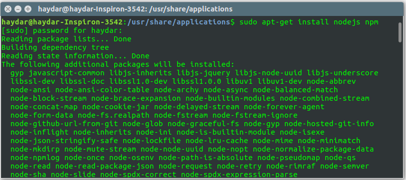
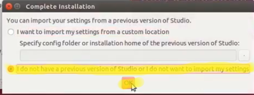
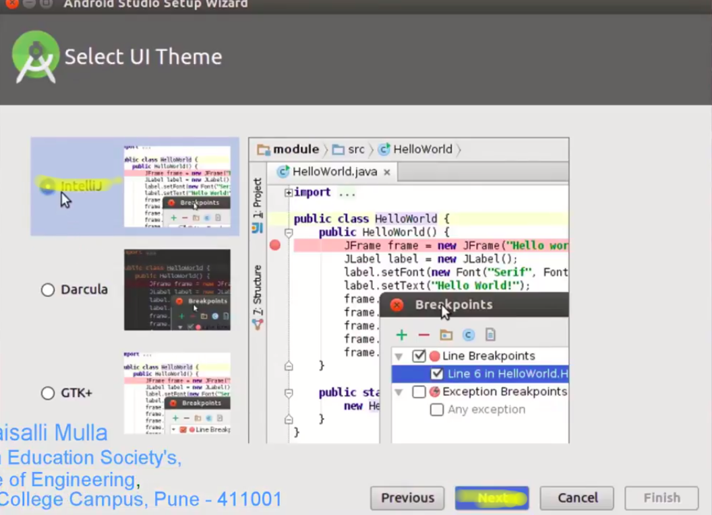
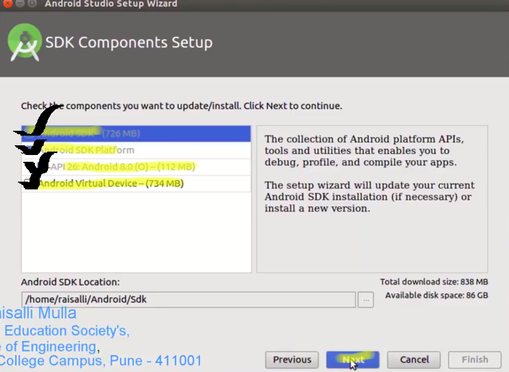
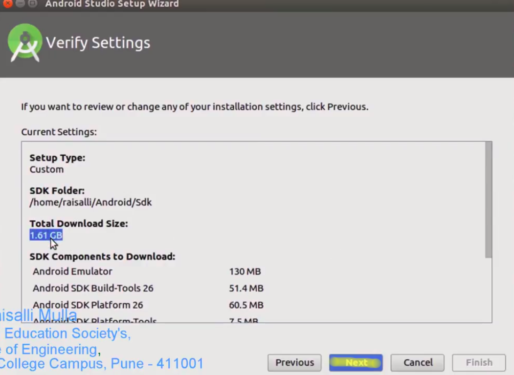
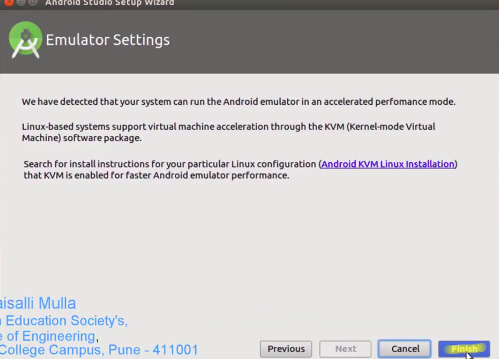
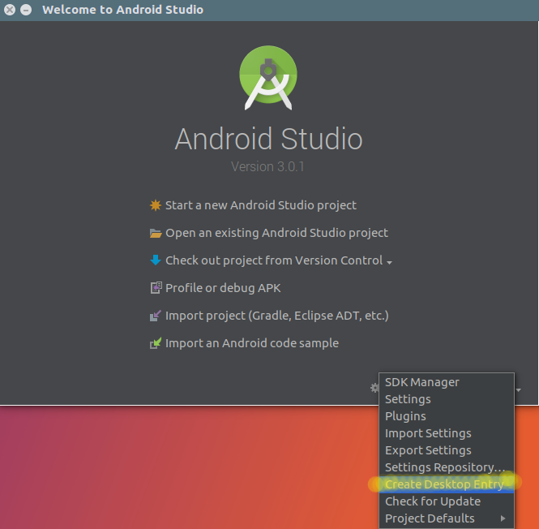
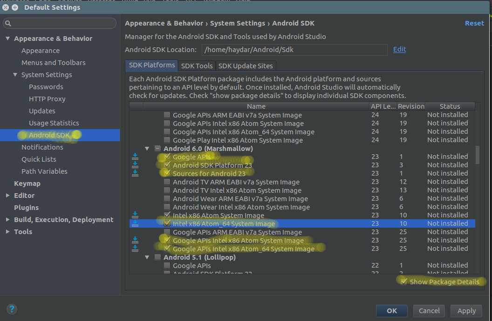

# Gnu/Linux Installation

Bu kurulum anlatılımı, popüler Linux dağıtımı olan Ubuntu işletim sistemine göre uyarlanmıştır. Sudo komutu ile başlayan komutlardan sonra şifrenizi girmenizi isterse giriniz.

## 1 - Nodejs ve NPM kurulumu

Linux için kurulum yapmak için öncelikle terminal'i \(Türkçe sistemlerde uçbirim\) açıyoruz. Ardından Ubuntu repositorylerinin \(Yazılımların adreslerinin bulunduğu adres depoları\) güncellemek için şu komutu terminale giriyoruz.

`sudo apt-get update`

Şimdi repolarımızı güncellediğimize göre nodejs ve npm \(nodejs package manager\) kurulumuna başlayabiliriz. Aşağıdaki komuta birde resimde bulunmayan yüklemeyi otomatik onaylamak için -y komutu ekledim. Kurulum için şu komutu terminalde çalışıtırın.

`sudo apt-get install -y nodejs npm`

Daha sonra npm paketlerimizi yüklerken nodejs'in çağrılırken sorun çıkarmaması için şu komutu terminalde çalıştıralım. Bu komut node ve nodejs ile hard link adı verilen bir ilişki \(Windows ortamındaki kısa yol gibi düşünün\) oluşturarak iki komut çağrıldığındada aynı şekilde çalışmasını sağlar.

`ln -s /usr/bin/nodejs /usr/bin/node`

### - React Native CLI Kurulumu

React Native komutlarımınızı çalıştığımız paketi yüklemek için aşağıdaki komutu terminalden çalıştırın.

`sudo npm install -g react-native-cli`

## 2 - JDK Kurulumu

Android emülatörümüzün çalışabilmesi için JDK'nın \(java developer kit\)bilgisayarımızda kurulu olması gerekiyor. Yalnız öncelikle uyarmak isterim ki React Native JDK olarak OpenJDK değil OracleJDK kurulmasını istiyor. Bu yazının yazıldığı tarihte en güncel Java sürümünün Java 9 ve React Native'in resmi sitesinde Java 8 ve üzeri JDKları desteklediğini söylemesine karşın, Java 9 kurulumundan sonra gradle\(ilerde nedir öğrenceksiniz\) tabanlı sorunlar olması nedeniyle burada Java 8 JDK anlatılacaktır.

Aşağıdaki kodu terminelden çalıştığımızda oracle java reposunu sistemimize eklemiş oluyoruz.

`sudo add-apt-repository ppa:webupd8team/java -y`

Yeni bir repo eklediğimizden ötürü sistemimizi şu komutla güncellememiz gerekiyor. Bu işlem biraz zaman alabilir.

`sudo apt-get update`

Sonunda Java kurulumu yapacağımız komutu çalıştırıyoruz. Bu işlem biraz zaman alabilir.

`sudo apt-get install oracle-java8-installer`

Şimdi yüklemiş olduğumuz java sürünü sistemin ortam değişkenlerine kaydedeceğiz. Bunun için şu komutu çalıştırın.

`sudo apt-get install oracle-java8-set-default`

## 3 - Android Studio Kurulumu

Android SDK'leri \(Software development kit / Yazılım geliştirme kiti\) ve AVD \(Android virtual machine\) içerdiğinden dolayı Android Studio'yu kurmamız gerekmektedir. İşletim sisteminiz 64bit ise şu paketleri terminalden yüklemeniz gerekmekte.

`sudo apt-get install libc6:i386 libncurses5:i386 libstdc++6:i386 lib32z1 libbz2-1.0:i386`

Öncelikle [Buradan](https://developer.android.com/studio/index.html) güncel Android studio sürmünü masaüstümüze indirelim. Sonra masaüstümğze gelip sağ --&gt; Open Terminal sonra aşağıdaki komutu çalıştıralım.

`unzip indirdiğimiz dosyanınn adı -d $HOME`

Örnek olarak,

`unzip android-studio-ide-171.4443003-linux.zip -d $HOME`

Bu komut indirdiğimiz zip paketinin içesindekileri Home klasörüne çıkartıyor. Şimdi kurulum scriptinin olduğu klasöre gidelim. Bunun için şu kodu çalıştıralım.

`cd $HOME/android-studio/bin`

Sıra geldi Scriptimizi çalıştırmaya... Script çalışırken söyleyene kadar terminal penceresini kapatmayın.

`./studio.sh`

Şimdi karşımıza çıkan ekranlarda üzerini sarı ile çizdiğim yerleri seçerek devam ediyoruz. 

Bu adım internetten veri indirdiği için uzun sürebilir lütfen sabırlı olun.

Şimdi terminal penceresini kapatabilirsiniz. Çıkan ekranda Configure --&gt; Create Desktop Entry yoluna tıklayınız. Daha sonra şifrenizi soran pencereye şifrenizi girip ok butonuna basınız.

Artık Android Studio'yu kullanmaya başlayabiliriz. Uygulamalar arasında "Android Studio" diye aratın ve Android Studio logosuna çift tıklayın. Daha sonra Configure --&gt; SDK Manager yoluna tıklayın. Çıkan ekranda önce resimdeki "Show Pakage Details", daha sonra diğer üzeri fosforlanmış yerlere ve sonra ok butonuna tıklayın.

Şimdi Android değişkenlerini sistemimize ekleyelim. Sistemimize her açtığımızada bunu yapmamıza gerek kalmasın diye tüm değişkenlerimizi export etmesi '$HOME/.bash\_profile' dosyasına yazmamız gerek. Öncelikle $HOME/.bash\_profile dosyamızı açmak için komut satırına şu kodu girelim.

`nano $HOME/.bash_profile`

Daha sonra ise aşağıdaki komutları kopyalıyarak terminale yapıştıralım. Ctrl + X kombinasyonu ile dosyamızı kapatma emri verelim, değişikliği kaydetmek için 'y' harfine basalım ve enter tuşuyla onaylayalım. En sonda tek seferliye mahsus aşağıdaki kodları kopyalıyarak direk terminale yapıştıralım.

`export ANDROID_HOME=$HOME/Android/Sdk`

`export PATH=$PATH:$ANDROID_HOME/tools`

`export PATH=$PATH:$ANDROID_HOME/platform-tools`

## 4 - AVD \(Android Virtual Devices\) Kurulumu

Öncelikle yeni bir proje oluşturup Android Studio ana ekranına ulaşıyoruz. Daha sonra AVD simgesine tıklayıp yeni bir avd oluşturuyoruz. Bu yazının yazılıdığı tarih de Android API 27 seviyeli cihazlara React Native desteği verildiği için ben bu seviyede bir AVD oluşturuyorum. Eğer bir sürüm bazlı bir sorun yaşarsanız Android 6.0 \(API 23\) bir AVD ile React Native uygulamanızı ayağa kaldırmayı deneyin. Ben kurulum esnasında API 27'yi bilgisayarıma indirdiğim için burada indirme yapmadan direk geçebildim. Eğer yaratmak istediğiniz sanal cihaz seviyeesinin üzerinde 'Download' yazısı varsa onun üzerine tıklayıp indirmelisiniz.

## 5 - İlk Projemizi Oluşturalım

Öncelikle terminal ekranınızı açın. Daha sonra şu komutları çalıştırın. Bu komut Home dizinize 'helloNative' adlı bir klasör açıp içine React Native için gerekli dosyaları koyacaktır. İkinci komut ise proje dosyamızın içine girmenizi sağlayacaktır.

`react-native init helloNative`

`cd helloNative`

### - AVD'yi çalıştırma

AVD'nin açılması sisteminizin özelliklerine göre uzun sürebilir ana ekran gelene kadar bekleyin. Performans için bilgisayarınızda çalışan gereksiz programları kapatın. AVD çalışmaya başladıktan sonra Android Studio'yu kapatmanız sisteminizi hızlandıracaktır.

AVD tamamen açıldıysa artık projemizi attach edebiliriz. Bunun için terminale şu komutu yazılım.

`react-native run-android`

