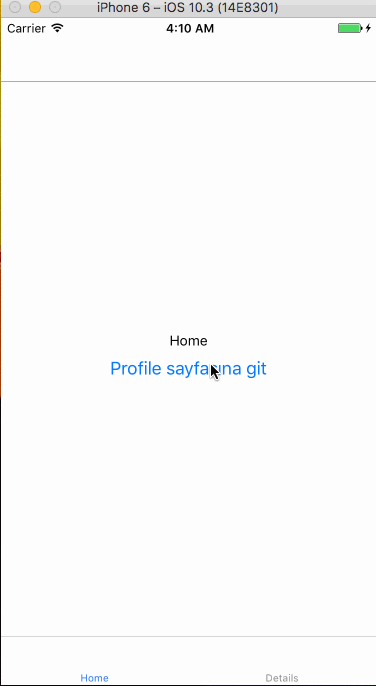

# İç İçe Navigator Kullanımı



Navigator'ler iç içe yazılabilir \( composable \) özelliğine sahiptir.Yukarıdaki örnekte TabNavigator ve StackNavigator ün nasıl kullanıldığını inceleyebilirsiniz.

```jsx
import { StackNavigator, TabNavigator } from "react-navigation";
import HomeScreen from "./src/screens/home";
import DetailsScreen from "./src/screens/details";
import ProfileScreen from "./src/screens/profile";

const MainNavigator = TabNavigator({
  Home: {
    screen: HomeScreen
  },
  Details: {
    screen: DetailsScreen
  }
});

const RootNavigator = StackNavigator({
    Main:{
        screen:MainNavigator  // Yukarıdaki TabNavigator 
    },
    Profile:{
        screen:ProfileScreen
    }
})

export default RootNavigator;
```

