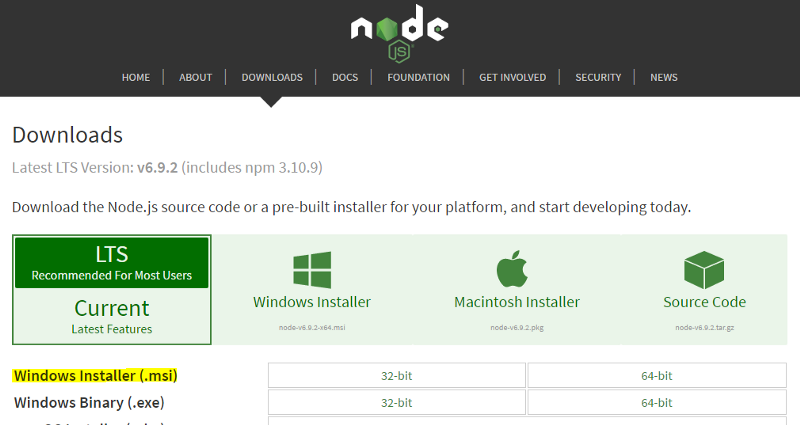
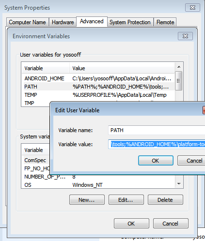
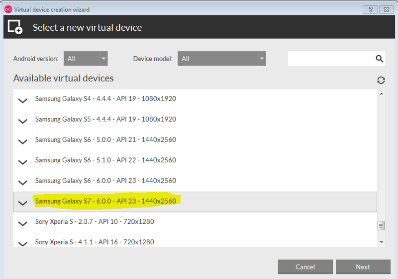
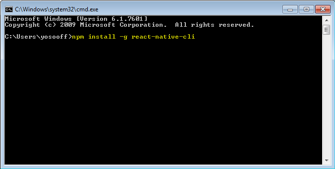
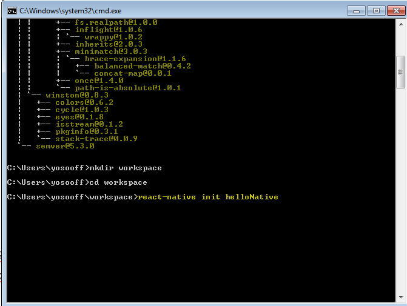
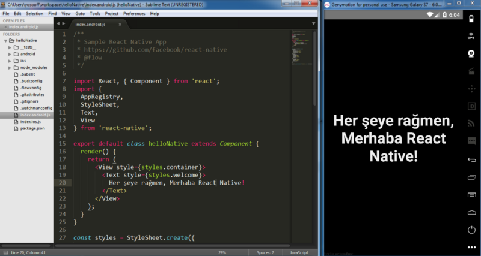

# Windows Installation

## Windows Installation

### 1-Node Js kurulumu

[Node JS](https://nodejs.org/en/download/) kurulumunu kendi sayfası üzerinden klasik olarak next next diyerek kurabilirsiniz.

### 2-Android Studio Kurulumu

[Android Studio](https://developer.android.com/studio/install.html) kurulum dosyasını indirip, kuralım. Android SDK nin nereye yükleneceği bilgisi önemli, aklımızda bulunsun.

Kurulumu yaparken bir seçim ekranı gelecek, burada “Custom Installation” seçeneğini seçmelisiniz.

Yükleme sırasında ya da zaten bilgisayarınızda yüklü bir Android Studio var ise aşağıdaki listedeki araçların yüklendiğinden emin olun. Yoksa “SDK Components Setup” ekranından yükleyin.

* * Android SDK
  * Android SDK Platform
  * Performance \(Intel HAXM\)
  * Android Virtual Device

  

Yukarıda ki resimde görüldüğü gibi “Android Studio Installation” otamatik olarak bilgisayarınıza Android’in en son sürümünü\(şu an için Android 7.1.1 Nougat\) kuracaktır. Ancak React-Native, Android 6.0 \(Marshmallow\) sürümünü istemektedir. Bunun için Android Studio’nun açılış sayfasında “Configure” butonuna tıklayıp, Ayarlar bölümünde “Android SDK” yı işaretleyip, buradan Marshmallow sürümünü kuralım.

Marshmallow sürümünü kurarken yukarıda işaretli araçları seçmeyi unutmayın. Eğer bu araçları göremiyorsanız, ekranın sağ alt köşesindeki “Show Package Details” seçeneğini işaretleyerek paket detaylarında görebilirsiniz. Apply butonuna basıp, tekrar next next diye devam ediyoruz.

Şimdi Sistem Değişkenlerine “**ANDROID\_HOME**” değişkenimizi ekleyelim.

ANDROID\_HOME değişkenini ekledikten sonra PATH değişkenine aşağıdaki satırı kopyalayıp yapıştırın. \(

_Tahminim en çok insanların gözünden kaçırdığı nokta burası oluyor, ortam değişkenlerini eklemeye, harf, noktalı virgül atlamamaya çok dikkat edin_\)  `;%ANDROID_HOME%\tools;%ANDROID_HOME%\platform-tools`

## 3-GenyMotion Kurulumu

GenyMotion bir Android Emulator. Android Studio’nun da sunduğu bir emulator var ama ben GenyMotion kullanmanızı öneririm.

GenyMotion ‘ ı kendi sitesine üye olup ücretsiz olarak [şuradan](https://www.genymotion.com/download/) indirebilirsiniz. Tabi bu arada GenyMotion ‘ ın Virtual Box üzerinde çalışan sanal bir telefon olduğunu düşünürsek, bilgisayarınızda Virtual Box da kurulu değilse, Virtual Box la beraber sunulan yükleme dosyasını indirmelisiniz.

GenyMotion kurduktan sonra GenyMotion hesabımızla giriş yapıp yeni bir sanal telefon ekleyelim. Ben kurduğumuz SDK ya uygun olarak,Samsung Galaxy S7 ‘ yi tercih ettim.

Genymotion muhtemelen kendi SDK’sı ile çalışmayacaktır. Bu yüzden az önce yüklediğimiz Android SDK’yı aşağıdaki gibi GenyMotion’ın ayarlarına ekleyelim. Bundan sonra Start komutu ile Android cihazımızı çalıştırabiliriz.

## 4-React-Native CLI Kurulumu

İşin zor kısmını atlattık. Şimdi Javascript dünyasına nihayet girebiliriz. İlk olarak komut satırına aşağıdaki kodu yazarak “react-native-cli” ‘ı global olarak yükleyelim.

`npm install -g react-native-cli`

Sonra ilk react-native projemizi kendi oluşturduğumuz bir workspace klasöründe aşağıdaki npm komutu ile yaratalım.

`react-native init helloNative`

GenyMotion’a yüklediğimiz sanal cihazımızı çalıştıralım ve proje klasörümüze komut satırıyla girip aşağıdaki kod ile projemizi sanal cihazımızda çalıştıralım.

`react-native run-android`

**Hata :** Bilgisayarımız da JAVA ve JDK yüklü değil.

**Çözüm:** [Şuradaki](http://www.oracle.com/technetwork/java/javase/downloads/jdk8-downloads-2133151.html) adresten son sürüm JDK yı indirebilirsiniz.

JDK’yı kurduktan sonra, tekrar react-native run-android komutu ile projemizi çalıştırmayı deneyelim.

**Hata:** Build Tools 23.0.1 i yüklemememişiz.

**Çözüm:** Komut satırına “android” komutu yazarak SDK manager’i açıp, eksik olan tool’u \(Build Tools 23.0.1\) kuralım.

Evet son sorunumuzu da çözdükten sonra tekrar **react-native run-android** komutunu çalıştıralım.

Ve nihayet çalıştırdık.

Ve şimdi aşağıda olduğu gibi, uygulamamızı yazabiliriz.

Kendi kurulumunuzda sorun yaşarsanız, yorumlarda yardımcı olmaya çalışırım.

_Not: React Native versiyonu olarak bu yazının yazıldığı an itibariye son sürüm olarak, 0.39.2 yi kurduk._

